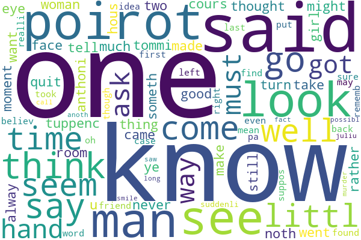

# Predict authors from their works using NLP and machine learning

```{r setup, include=FALSE}
knitr::opts_chunk$set(echo = FALSE)
knitr::opts_chunk$set(warning = FALSE)
knitr::opts_chunk$set(message = FALSE)

library(dplyr)
library(ggplot2)
library(caret)
library(nnet)  # Multinomial logit
library(e1071)  # Naive Bayes
library(randomForest)
library(gbm)
library(xgboost)
library(tidytext)  # Sentiment analysis
```

## Introduction
Identifying the author of a text poses a challenge for humans, yet algorithms offer a promising solution by discerning patterns in writing styles. This study uses natural language processing (NLP) and machine learning techniques to predict 10 authors from their 100 works, achieving an 89% predictive accuracy.

## Data collection
A total of 100 English works by 10 authors were downloaded from [Gutenberg](https://www.gutenberg.org/) using the `gutenbergr` package, as detailed in [1-gutenberg_download.R](1-gutenberg_download.R).

## Data preprocessing
Data preprocessing was conducted using NLP and the `NLTK` package, as outlined in [2-NLP.ipynb](2-NLP.ipynb). The following steps were taken:  
1. **Lowercasing**: Convertint all letters to lowercase, as uppercase and lowercase letters are typically treated the same.  
    - Example: "Retailers and 10 Ice-creams" becomes "retailers and 10 ice-creams".  
2. **Tokenization**: Splitting text into individual words and chunks.  
    - Example: "retailers and 10 ice-creams" becomes "retailers", "and", "10", "ice-creams".  
3. **Stop Word Removal**: Removing common words such as "the", "and", "in" as they do not carry useful information.  
    - Example: "retailers", "10", "ice-creams" remains.  
4. **Regular Expressions**: Retaining only English letters, removing numbers and punctuation.  
    - Example: "retailers" remains.  
5. **Stemming and Lemmatization**: Reducing words to their root forms for easier analysis.  
    - Example: "retailers" becomes "retail".  

## Feature extraction
I converted textual data to numerical features using the `sklearn` package so that machine learning algorithms can understand.  
```{r Read data}
author <- read.csv("data/author.csv")  # y variable
bow <- read.csv("data/bag-of-words.csv")  # X variables
tfidf <- read.csv("data/tf-idf.csv")  # X variables
```

Bag-of-Words (BoW) counts occurrences of each word, resulting in a wide vector for a text, where each column represents a word. When multiple texts are stacked together, BoW forms a wide matrix. Below is its head:
```{r Head of BoW}
bow[1:5, 1:20] |> knitr::kable()
```

An improvement of BoW is TF-IDF (term frequency–inverse document frequency). Since documents vary in length, 10 occurrences of "apples" in a 1000-word document may not be more important than 8 occurrences in a 10-word document. Therefore, term frequency measures how frequently a word appears in a document. Moreover, "car" may appear very often in every car review, so it may not carry additional information. Thus, words that are common across many documents get a lower inverse document frequency score, while rare words get a higher score. In summary, TF-IDF emphasizes words that are both significant within a specific document and relatively uncommon across the whole set of documents. Below is its head:
```{r Head of TFIDF}
tfidf[1:5, 1:20] |> knitr::kable()
```

## Dimentionality reduction
Using TF-IDF for further analysis, Principal Component Analysis (PCA) reduced the dimensionality from around 35,000 unique words to 20 principal components.  
```{r PCA}
# Standardize the data
scaled_data <- scale(tfidf)

# PCA, reduce to 20 components, explain 44% original variance
pca <- prcomp(scaled_data, rank. = 20)
```

## Supervised learning
The outcome variable ($y$) contains 10 authors, and the feature variables ($X$) are the 20 principle components. The dataset was split into 80% training data and 20% test data. 7 classification models were evaluated: logistic regression, Lasso, Naive Bayes, KNN, random forest, GBM, and XGBoost. These models were trained on the training data, and their predictions were compared to actual outcomes in the test data.  
```{r Train-test split}
df <- cbind(author, pca$x)  # Combine 2 data frames
df$author_name <- factor(df$author_name)

set.seed(42)
index <- createDataPartition(df$author_name,
                             p = 0.8, list = FALSE)
train <- df[index, ]
test <- df[-index, ]
```

In logistic regression, I used Softmax function to handle multiple classes in the outcome variable.  
```{r Logistic regression, results='hide'}
# Fit multinomial logistic regression
logit <- multinom(author_name ~ ., data = train)
# Predict classes
logit_pred <- predict(logit, test)
# Confusion matrix
logit_cm <- confusionMatrix(logit_pred, test$author_name)
```

Logistic regression with too many features may result in overfitting. Thus, I used Lasso to regularize it. I used 10-fold cross-validation in the training data to find the optimal regularization parameter $\lambda$.  
```{r Lasso, results='hide'}
# 10-fold cross validation
ctrl <- trainControl(method = "cv", number = 10)

set.seed(42)
lasso <- train(author_name ~ .,
               data = train,
               method = "multinom",
               trControl = ctrl,
               alpha = 1)
lasso_pred <- predict(lasso, test)
lasso_cm <- confusionMatrix(lasso_pred, test$author_name)
```

Naive Bayes assumes every feature is independent of all other features, conditional on the class labels of the outcome variable.  
```{r Naive Bayes}
nb <- naiveBayes(author_name ~ ., data = train)
nb_pred <- predict(nb, test)
nb_cm <- confusionMatrix(nb_pred, test$author_name)
```

KNN measures distances between features. I used 10-fold cross-validation in the training data to find the optimal number of neighbors $k$.  
```{r KNN}
ctrl <- trainControl(method = "cv", number = 10)

set.seed(42)
knn <- train(author_name ~ .,
             data = train,
             method = "knn",
             trControl = ctrl)
knn_pred <- predict(knn, test)
knn_cm <- confusionMatrix(knn_pred, test$author_name)
```

```{r Random Forest}
set.seed(42)
rf <- randomForest(author_name ~ ., data = train)
rf_pred <- predict(rf, test)
rf_cm <- confusionMatrix(rf_pred, test$author_name)
```

In gradient boosting models (GBM and XGBoost), I used grid search with 5-fold cross-validation in the training data to find optimal parameters.  
```{r GBM optimal parameters, eval=FALSE}
# Parameter grid
param_grid <- expand.grid(
  n.trees = c(50, 100, 200, 500),
  interaction.depth = c(3, 5, 7, 9),
  shrinkage = c(0.01, 0.05, 0.1, 0.3),
  n.minobsinnode = c(10, 20)
)
# Number of boosting iterations
# Maximum depth of trees
# Learning rate
# Minimum number of observations in node

# Grid search with cross validation
ctrl <- trainControl(method = "cv", number = 5)
set.seed(42)
gbm_best <- train(author_name ~ .,
                  data = train,
                  method = "gbm",
                  trControl = ctrl,
                  tuneGrid = param_grid)

# Optimal parameters
gbm_best$bestTune
```

```{r GBM}
set.seed(42)
gbm <- gbm(author_name ~ .,
           data = train,
           distribution = "multinomial",
           n.trees = 200,
           interaction.depth = 9,
           shrinkage = 0.3,
           n.minobsinnode = 10)
gbm_pred_prob <- predict(gbm, test, type = "response")
gbm_pred_class <- colnames(gbm_pred_prob)[apply(gbm_pred_prob, 1, which.max)]
gbm_cm <- confusionMatrix(factor(gbm_pred_class), test$author_name)
```

```{r XGBoost optimal parameters, eval=FALSE}
param_grid <- expand.grid(
  nrounds = c(50, 100, 200, 500),
  max_depth = c(3, 5, 7, 9),
  eta = c(0.01, 0.05, 0.1, 0.3),
  gamma = 0,
  colsample_bytree = 1.0,
  min_child_weight = 1,
  subsample = 1.0
)
# Number of boosting rounds
# Maximum depth of a tree
# Learning rate
# Minimum loss reduction required to make a further partition on a leaf node
# Subsample ratio of columns when constructing each tree
# Minimum sum of instance weight needed in a child
# Subsample ratio of the training instances

ctrl <- trainControl(method = "cv", number = 5)
set.seed(42)
xgb_best <- train(author_name ~ .,
                  data = train,
                  method = "xgbTree",
                  trControl = ctrl,
                  tuneGrid = param_grid)

xgb_best$bestTune
```

```{r XGBoost}
# Convert the data to matrix format required by xgboost
train_matrix <- xgb.DMatrix(data = as.matrix(train[, -1]),
                            label = as.numeric(train$author_name) - 1)
test_matrix <- xgb.DMatrix(data = as.matrix(test[, -1]),
                           label = as.numeric(test$author_name) - 1)

# Model parameters
params <- list(
  objective = "multi:softmax",
  num_class = 10,
  max_depth = 3,
  eta = 0.1
)

set.seed(42)
xgb <- xgb.train(params, train_matrix, nrounds = 100)
xgb_pred <- predict(xgb, test_matrix)
xgb_pred_class <- levels(df$author_name)[xgb_pred + 1]
xgb_cm <- confusionMatrix(factor(xgb_pred_class), test$author_name)
```

Below is the overall accuracy, measuring the proportion of accurate predictions in test data. Random Forest achieved the highest accuracy at 0.8947, significantly outperforming random guessing 10 classes of authors.  
```{r Overall accuracy}
data.frame(
  model = c(
    "Logistic regression",
    "Lasso",
    "Naive Bayes",
    "KNN",
    "Random forest",
    "GBM",
    "XGBoost"),
  overall_accuracy = c(
    logit_cm$overall[1],
    lasso_cm$overall[1],
    nb_cm$overall[1],
    knn_cm$overall[1],
    rf_cm$overall[1],
    gbm_cm$overall[1],
    xgb_cm$overall[1]) |>
    round(4)
) |>
  knitr::kable()
```

## Clustering
I used K-means to group 100 works into 12 clusters. There is no "optimal" number of clusters $k$, so I tried it from 2 to 20, finding that 12 had a better performance. In the table below, each row represents a cluster. Notably, Cluster 4 mainly contains works by Daniel Defoe, indicating new works falling into this cluster are likely authored by him.  
```{r K-means}
set.seed(42)
kmeans_12 <- kmeans(df[, -1], centers = 12)  # Choose 12 clusters
table(kmeans_12$cluster, df$author_name) |> knitr::kable()
```

## Sentiment analysis
In a sentiment lexicon like Afinn, positive words have higher sentiment scores. For example, "good" scores 3 while "bad" scores -3. In each single document, I multiplied the sentiment score of each word by its term frequency to balance different lengths of documents, then summed up all multiplications to get one sentiment score.  
From the figure below, my selection of Jane Austen's works are more positive, while Agatha Christie's are more negative.  
```{r Sentiment analysis}
# Term frequency of each document
tf <- (bow / rowSums(bow)) |>
  t() |> as.data.frame()  # Transpose
tf$word <- colnames(bow)

# Load sentiment lexicon Afinn
sentiment_lexicon <- get_sentiments(lexicon = "afinn")

tf_merge <- tf |> inner_join(sentiment_lexicon, by = "word")

# Vector * Matrix -> Vector
sentiment_score <-
  tf_merge$value %*% as.matrix(tf_merge[, 1:ncol(tf)-1]) |>
  t() |> as.data.frame()  # Transpose
colnames(sentiment_score) <- "sentiment_score"

# Combine "author" column
sentiment_score$author_name <- factor(author$author_name)

# Visualize the results
ggplot(sentiment_score) +
  geom_point(aes(author_name, sentiment_score)) +
  xlab("Author") +
  ylab("Sentiment Score") +
  theme(axis.text.x = element_text(angle = 90, hjust = 1))
```

## Word cloud
Word clouds visualized word frequencies for each author (using the `wordcloud` package, saving in the [wordcloud](wordcloud) folder). "One" is the most prevalent among all authors. Notably, the famous detective "Poirot" frequently appears in Agatha Christie's works. Below is the word cloud of her works.  

